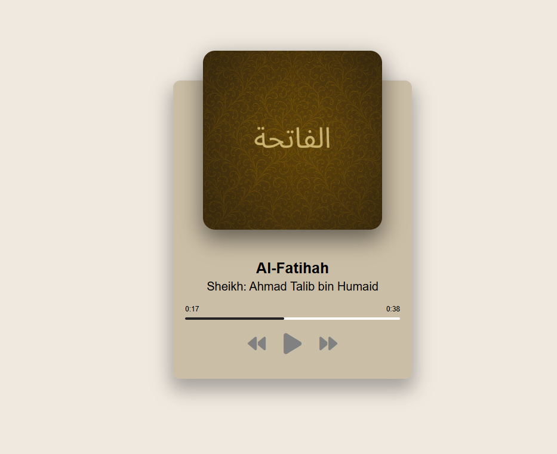

# Sound Player

A responsive and interactive web-based sound player that allows users to play, pause, and navigate through a list of Quranic surahs. Each surah is accompanied by an image and the name of the reciter. Built using **HTML**, **CSS**, and **JavaScript**.

---

## Features

- Play / Pause audio
- Next / Previous surah
- Interactive progress bar with current and total time
-  Dynamic surah image and reciter name
-  Auto-play next surah when current ends
-  Responsive and accessible design

---
## Getting Started

To run the project locally:

1. Clone or download the repository.
2. Make sure the `img/` and `audio/` folders contain the correct image and audio files for the surahs.
3. Open `index.html` in your browser.

---
## How It Works

- The player displays one surah at a time with its title, reciter name, and image.
- JavaScript handles loading the correct audio and image, managing the play state, updating the progress bar, and switching between surahs.
- Clicking on the progress bar will seek to that position in the audio.
- The player auto-plays the next surah when the current one ends.

---
## Technologies Used

- **HTML5** for structure
- **CSS3** for styling
- **JavaScript** (Vanilla) for interactivity

---
## Preview

---
##  License

This project is for educational and personal use. Feel free to modify and use it as a template for your own sound-based web applications.
